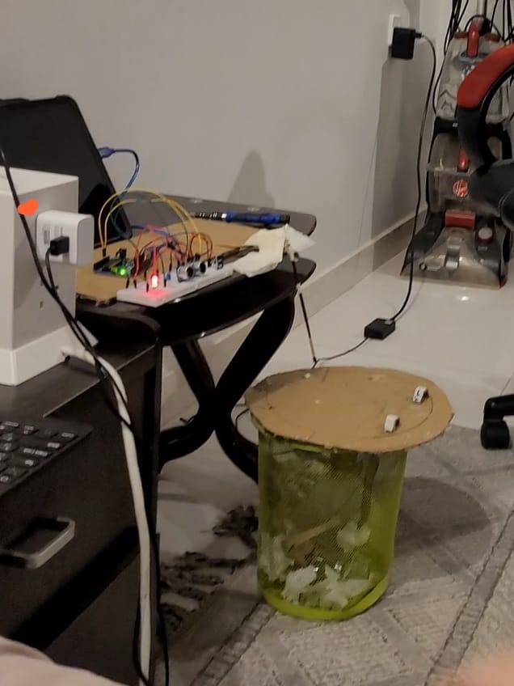

# Arduino---Auto-trash-Lid-IR

# Description:
an infrared remote and an ultrasonic distance sensor.
When a button on the remote is pressed, a buzzer sounds briefly, an LED light turns on, and the trash can lid opens using a servo motor.
Additionally, if an object is detected within 30 cm by the ultrasonic sensor, the buzzer sounds as an alert, the LED lights up, and the lid opens automatically.
After 4 seconds, the lid closes again and the LED turns off.

